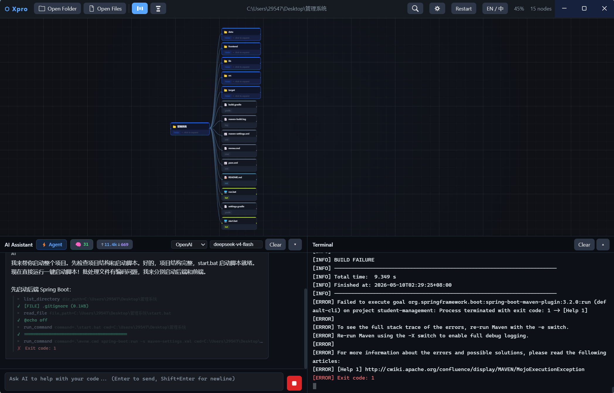
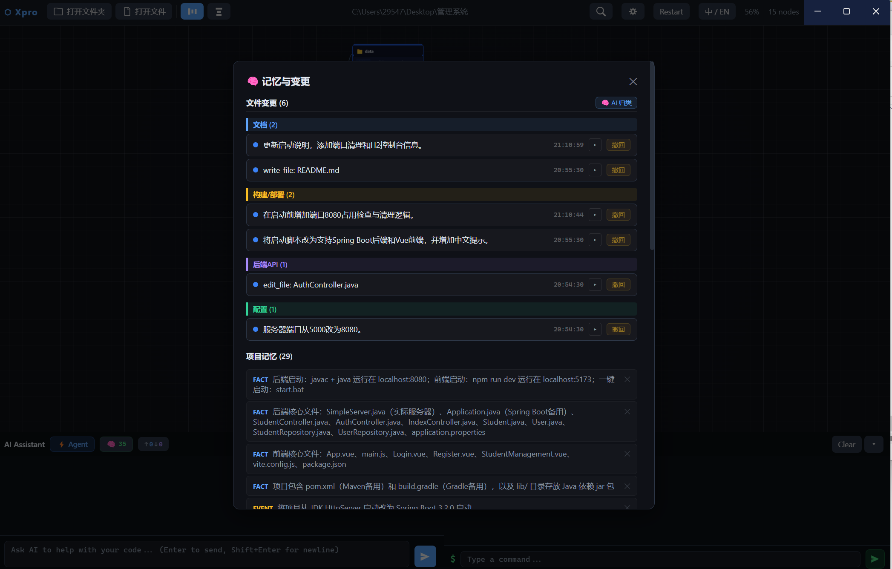

# Xpro

AI-powered desktop IDE with autonomous agent mode. It reads and edits your codebase, runs shell commands, manages sub-agents, and remembers project context across sessions — all from a single GUI window.

Optimized for DeepSeek (`deepseek-v4-pro` / `deepseek-v4-flash`), and also compatible with OpenAI and Anthropic protocols.

[简体中文](#简体中文)

### Screenshots

**Agent Mode** — AI autonomously reads files, runs commands, and edits code:



**Memory & Change Tracking** — AI-categorized file changes + project memory:



## What Is It?

Xpro is a desktop coding IDE that combines a full-featured code editor (Monaco / VS Code core) with an AI agent that can autonomously modify your project. It runs as a native Electron application on Windows.

### Key Features

- **Agent mode** — the AI reads files, writes code, runs commands, and verifies results autonomously until the goal is complete
- **Sub-agent system** — spawns parallel child agents for complex multi-step tasks
- **Project memory** — cross-session memory extraction, storage, and recall so the AI remembers your codebase context
- **AI-powered change categorization** — file changes are automatically grouped by impact area (Frontend UI, Backend API, Config, etc.)
- **Thinking mode** — toggle DeepSeek's reasoning mode to see the model's chain-of-thought
- **Visual annotation** — screenshot and draw on your screen, the AI reads your annotations and edits the corresponding code
- **Multi-provider** — DeepSeek, OpenAI, Anthropic via a unified OpenAI-compatible protocol layer
- **Monaco Editor** — VS Code's editor core with syntax highlighting for 20+ languages, multi-tab editing
- **Integrated terminal** — real PowerShell session embedded in the IDE, command output synced to the AI
- **Rust-native search** — file traversal (`walkdir`) and full-text search (`ripgrep`-style) via `napi-rs` for native speed
- **File change tracking** — every AI edit creates a checkpoint with diff view, one-click undo/redo
- **Approval gates** — review and approve AI changes before they are applied
- **Live cost tracking** — per-turn token usage displayed in the status bar
- **Dark theme** — PyOneDark-inspired UI with resizable three-panel layout

## How It's Wired

```
Electron main process (TypeScript)
├── ai-bridge.ts        ← OpenAI/Anthropic streaming client, tool-call loop, thinking mode
├── ai-tools.ts         ← Tool registry: read_file, write_file, edit_file, search, shell, sub_agent
├── memory-pipeline.ts  ← LLM-based memory extraction, change summarization, AI categorization
├── memory-store.ts     ← Vector-free memory storage with recall/forget/supersede
├── ipc.ts              ← IPC handlers bridging main ↔ renderer
└── preload.ts          ← contextBridge API surface

Electron renderer (TypeScript + Webpack)
├── WorkflowCanvas.ts   ← Main UI controller: chat, settings, memory panel, annotation
├── Editor.ts           ← Monaco Editor integration
├── FileTree.ts         ← Project file explorer
├── Terminal.ts         ← Embedded PowerShell
└── services/           ← AiService, CheckpointService, ApprovalService, AnnotationService

Rust native module (napi-rs)
├── search.rs           ← High-speed file/text search
└── diff.rs             ← Line-level diff computation
```

## Install

### Prerequisites

| Dependency | Version |
|-----------|---------|
| Node.js   | 18+     |
| Rust      | 1.70+   |
| npm       | 9+      |

### From Source

```bash
git clone https://github.com/HopkeyEZ/Xpro.git
cd Xpro
npm install

# Build the Rust native module
cd native
npm install
npm run build
cd ..
```

### Development

```bash
npm run build:main      # compile TypeScript (main process)
npm start               # launch Electron in dev mode
```

### Package for Windows

```bash
npm run build           # build main + renderer
npm run dist            # electron-builder → NSIS installer in dist/
```

Prebuilt installers will be available on the [Releases](https://github.com/HopkeyEZ/Xpro/releases) page.

## Quickstart

1. Launch Xpro
2. Click the **Settings** button in the toolbar
3. Configure your AI provider:

```
Provider:  OpenAI
Base URL:  https://api.deepseek.com
API Key:   sk-your-deepseek-api-key
Model:     deepseek-v4-flash
```

Settings are saved to `~/.xpro/config.json`.

4. Open a project folder
5. Type a task in the AI chat panel — the agent will start working

### Supported Providers

| Provider | Base URL | Models |
|----------|----------|--------|
| DeepSeek | `https://api.deepseek.com` | `deepseek-v4-pro`, `deepseek-v4-flash` |
| OpenAI | `https://api.openai.com/v1` | `gpt-4o`, `gpt-4o-mini`, etc. |
| Anthropic | `https://api.anthropic.com` | `claude-sonnet-4-20250514`, etc. |

Any OpenAI-compatible endpoint works (e.g. local Ollama, vLLM, LM Studio).

## Contributing

Pull requests welcome. Check the [open issues](https://github.com/HopkeyEZ/Xpro/issues) for ideas.

> **Note:** Not affiliated with DeepSeek Inc., OpenAI, or Anthropic.

## License

[MIT](LICENSE)

---

<a name="简体中文"></a>

## 简体中文

Xpro 是一个桌面 AI 编程 IDE，内置自主 Agent 模式。AI 可以直接读写代码、执行命令、管理子代理、跨会话记忆项目上下文。

专为 DeepSeek（`deepseek-v4-pro` / `deepseek-v4-flash`）优化，同时兼容 OpenAI 和 Anthropic 协议。

### 核心功能

- **Agent 模式** — AI 自主读文件、写代码、执行命令、验证结果
- **Sub-Agent 并行** — 复杂任务自动拆分给多个子代理并行执行
- **项目记忆** — 跨会话提取、存储、召回项目上下文
- **AI 变更归类** — 文件变更自动按影响范围分组（前端UI、后端API、配置等）
- **思考模式** — 开启 DeepSeek 推理链，查看 AI 的思考过程
- **可视化标注** — 截图圈画，AI 直接修改对应代码
- **Monaco 编辑器** — VS Code 同款内核，20+ 语言高亮
- **内嵌终端** — 真实 PowerShell 会话
- **Rust 原生搜索** — 基于 napi-rs 的高速文件/文本搜索
- **变更检查点** — 每次 AI 修改自动记录，支持一键撤回/恢复
