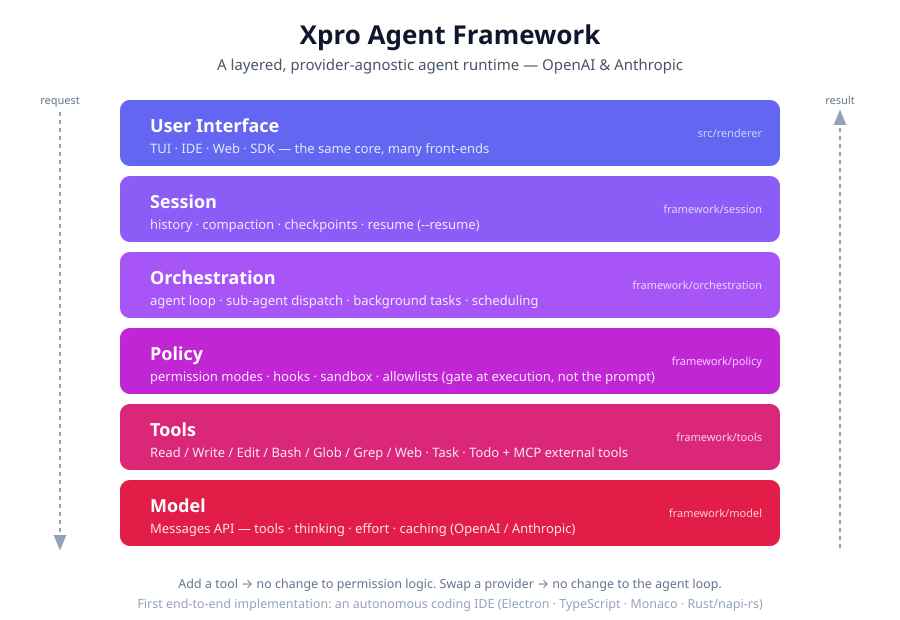

# Xpro

An **extensible multi-agent framework** — a reusable core of a tool-calling loop, sub-agents, cross-session memory, and a unified multi-model protocol layer. Register your own tools to embed AI agents into any app. First shipped as an autonomous coding IDE.

Supports the **OpenAI** and **Anthropic** protocols.

[简体中文](#简体中文)

<p align="center">
  
</p>

## What Is It?

Xpro is an extensible multi-agent framework: its core — a tool-calling loop, sub-agent orchestration, cross-session memory, and a unified multi-model protocol layer — is reusable, so you can register your own tools and drop AI agents into any application (a server, a CLI, a mini-program / SaaS backend).

Its first end-to-end implementation is a **desktop coding IDE** that pairs a full-featured code editor (Monaco / VS Code core) with an AI agent that autonomously modifies your project, running as a native Electron application on Windows.

## Architecture

The framework is organized as six layers, bottom to top. Each layer talks only to the one below it, so **adding a tool never touches permission logic, and swapping a provider never touches the agent loop**.

| Layer | Responsibility | Code |
|-------|----------------|------|
| **User Interface** | TUI / IDE / Web / SDK — many front-ends, one core | `src/renderer` |
| **Session** | history, compaction, checkpoints, resume | `src/framework/session` |
| **Orchestration** | agent loop, sub-agent dispatch, background tasks | `src/framework/orchestration` |
| **Policy** | permission modes, hooks, sandbox, allowlists | `src/framework/policy` |
| **Tools** | Read/Write/Edit/Bash/Glob/Grep/Web… + MCP | `src/framework/tools` |
| **Model** | Messages API — tools / thinking / effort / caching (OpenAI · Anthropic) | `src/framework/model` |

At its heart is the agent loop — strip away every wrapper and it's just: call the model with the tools, run the tool calls it asks for, pair every result back by id, repeat until the model is done. Everything else (round caps, permission gates, sub-agent isolation, compaction) is that loop made safe for production.

## Use as a Framework (SDK)

```ts
import { createAgent, defineTool } from 'xpro';

// Register your own business tool
const placeOrder = defineTool({
  name: 'place_order',
  description: 'Place an order in the shop backend',
  parameters: {
    type: 'object',
    properties: { sku: { type: 'string' }, qty: { type: 'number' } },
    required: ['sku', 'qty'],
  },
  mutates: true,
  handler: async ({ sku, qty }) => {
    // call your real OpenAPI here
    return `ordered ${qty} × ${sku}`;
  },
});

const agent = createAgent({
  provider: 'anthropic',                 // or 'openai'
  baseUrl: 'https://api.anthropic.com',
  apiKey: process.env.ANTHROPIC_API_KEY!,
  model: 'claude-sonnet-4',
  mode: 'default',                       // ask before side-effecting tools
  tools: [placeOrder],
  approve: async (intent) => confirm(`Run ${intent.tool.name}?`),
});

const { finalText } = await agent.run('Order 2 units of SKU-42 and confirm');
```

The same core powers the IDE, a mini-program backend, or any service that needs an agent. Build the library with `npm run build:framework` (outputs `dist/framework`, exported as the package entry).

## Core Capabilities

Everything the framework provides, independent of any front-end:

- **Autonomous agent loop** — the model calls tools, executes them, and verifies results until the goal is complete
- **Sub-agent isolation** — dispatch parallel child agents; the parent only receives the summary, keeping its context clean
- **Cross-session memory** — extract, store, and recall context across runs (vector-free store with recall / forget / supersede)
- **Pluggable tool registry** — register your own tools; MCP-compatible external tools
- **Policy & approval gates** — permission modes, hooks, and allowlists enforced at the execution layer, not the prompt
- **Session management** — history, compaction, checkpoints, and resume
- **Unified model layer** — OpenAI and Anthropic behind one interface: tools / thinking / effort / caching
- **Interruptible + background tasks** — long runs can be aborted or backgrounded without losing state
- **Action checkpoints** — every mutating step is recorded, with one-click rollback
- **Rust-native primitives** — high-speed file traversal and full-text search via `napi-rs`

## Install

### Prerequisites

| Dependency | Version |
|-----------|---------|
| Node.js   | 18+     |
| Rust      | 1.70+   |
| npm       | 9+      |

### From Source

```bash
git clone https://github.com/HopkeyEZ/Xpro.git
cd Xpro
npm install

# Build the Rust native module
cd native && npm install && npm run build && cd ..
```

### Development

```bash
npm run build:main        # compile the main process
npm run build:framework   # compile the framework SDK → dist/framework
npm start                 # launch Electron in dev mode
```

### Package for Windows

```bash
npm run build             # main + framework + renderer + native
npm run dist              # electron-builder → NSIS installer in dist/
```

Prebuilt installers will be available on the [Releases](https://github.com/HopkeyEZ/Xpro/releases) page.

## Quickstart (IDE)

1. Launch Xpro
2. Click **Settings** in the toolbar
3. Configure your AI provider:

```
Provider:  OpenAI
Base URL:  https://api.openai.com/v1
API Key:   sk-your-api-key
Model:     gpt-4o
```

Settings are saved to `~/.xpro/config.json`.

4. Open a project folder
5. Type a task in the AI chat panel — the agent will start working

### Supported Providers

| Provider | Base URL | Models |
|----------|----------|--------|
| OpenAI | `https://api.openai.com/v1` | `gpt-4o`, `gpt-4o-mini`, etc. |
| Anthropic | `https://api.anthropic.com` | `claude-sonnet-4`, etc. |

Any OpenAI-compatible endpoint works (e.g. local Ollama, vLLM, LM Studio).

## Contributing

Pull requests welcome. Check the [open issues](https://github.com/HopkeyEZ/Xpro/issues) for ideas.

> **Note:** Not affiliated with OpenAI or Anthropic.

## License

[MIT](LICENSE)

---

<a name="简体中文"></a>

## 简体中文

Xpro 是一套**可二次开发的多智能体（Multi-Agent）框架**：将工具调用循环、主 / 子 Agent 编排、跨会话记忆、多模型统一协议层沉淀为可复用内核，开发者注册自己的业务工具即可为任意应用（服务端、CLI、小程序 / SaaS 后端）接入 AI Agent 能力。首个落地形态是一个自主编程 IDE。

仅支持 **OpenAI** 与 **Anthropic** 协议。

### 六层架构

自底向上分为六层，每层只与下一层交互——**新增工具不改权限逻辑，更换模型不改 agent loop**：

- **用户界面** — TUI / IDE / Web / SDK
- **会话层** — 历史、compaction、检查点、恢复(--resume)
- **编排层** — agent loop、子 agent 派发、后台任务、调度
- **策略层** — 权限模式、钩子、沙箱、允许列表（门设在执行层，不在提示词）
- **工具层** — Read/Write/Edit/Bash/Glob/Grep/Web… + MCP 外部工具
- **模型层** — Messages API（tools / thinking / effort / caching），OpenAI / Anthropic

### 作为框架使用

```ts
import { createAgent, defineTool } from 'xpro';

const agent = createAgent({
  provider: 'anthropic',
  baseUrl: 'https://api.anthropic.com',
  apiKey: process.env.ANTHROPIC_API_KEY!,
  model: 'claude-sonnet-4',
  tools: [ /* 你的业务工具 */ ],
});

await agent.run('帮我处理订单 #1234 的退款并通知买家');
```

### 核心能力

以下能力由框架内核提供，与任何前端无关：

- **自主 Agent 循环** — 模型调用工具、执行、验证，直到目标完成
- **子 Agent 隔离** — 派发并行子 agent，主线只收到摘要，上下文保持干净
- **跨会话记忆** — 跨运行提取、存储、召回（无向量存储，支持 recall / forget / supersede）
- **可插拔工具注册表** — 注册你自己的业务工具，兼容 MCP 外部工具
- **策略与审批门** — 权限模式、钩子、允许列表，落在执行层而非提示词
- **会话管理** — 历史、compaction、检查点、resume
- **统一模型层** — OpenAI 与 Anthropic 同一接口：tools / thinking / effort / caching
- **可中断 + 后台任务** — 长任务可打断或转后台，状态不丢
- **动作检查点** — 每步有副作用的操作都记录，可一键回滚
- **Rust 原生组件** — 基于 napi-rs 的高速文件遍历与全文搜索
